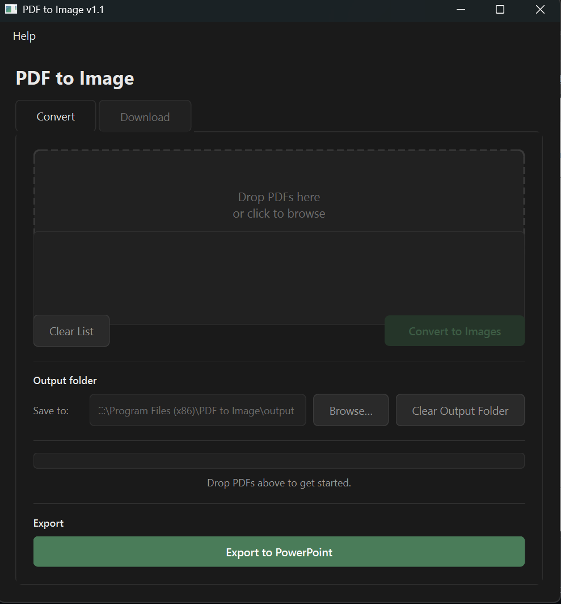

# PDF to Image

**Batch convert PDFs to images and download PDFs from any web page — no installation required.**

---



---

## Features

- **Batch convert** — drop multiple PDFs at once and convert them all to images
- **Choose format** — export as PNG or JPEG
- **Custom DPI** — select 72, 150, or 300 DPI for screen or print quality
- **Web download tab** — paste a URL, scan the page for PDF links, and download them in bulk
- **No installation needed** — single `.exe`, just double-click and go (Windows)
- **Free and open source** — MIT licensed

---

## Download & Install

### Windows (recommended)

1. Go to the [**Releases page**](../../releases/latest)
2. Download `PDFtoImage_setup.exe`
3. Run the installer and follow the prompts

> **Windows SmartScreen warning?** Click **More info** then **Run anyway**. The app is safe — SmartScreen flags unsigned apps from new publishers.

---

### Mac / Linux (run from source)

**Requirements:** Python 3.9+, pip

```bash
# Clone the repository
git clone https://github.com/NateRudquist/PDFtoIMAGE.git
cd PDFtoIMAGE

# Install dependencies
pip install -r requirements.txt

# Run the app
python main.py
```

> **Mac users:** You may also need Poppler for PDF rendering:
> ```bash
> brew install poppler
> ```
>
> **Linux users:**
> ```bash
> sudo apt install poppler-utils
> ```

---

## Support This Project

If PDF to Image saves you time, consider buying me a coffee!

[](https://ko-fi.com/naterudquist)

---

## Changelog

See [CHANGELOG.md](CHANGELOG.md) for version history.

---

## License

MIT License — see [LICENSE](LICENSE) for details.

Copyright (c) 2026 Nate Rudquist
